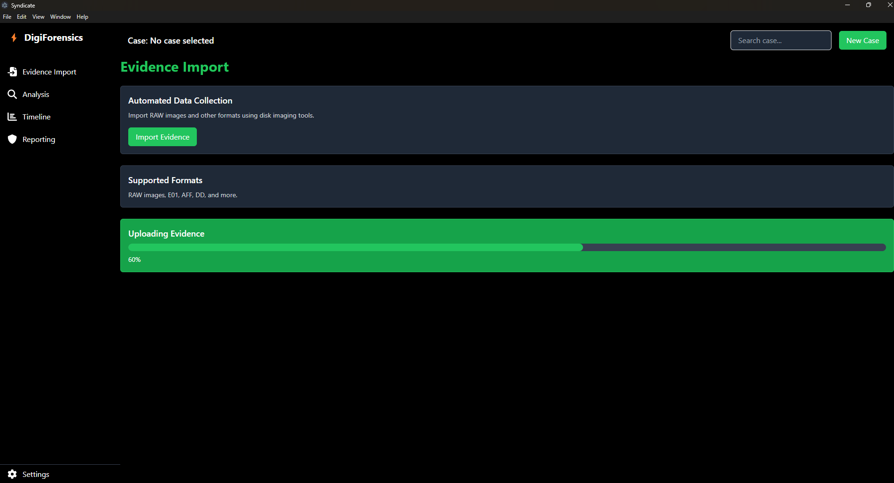
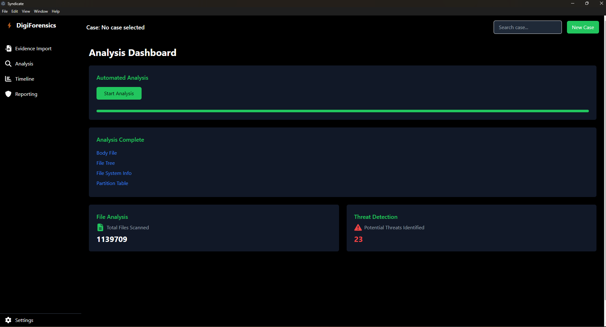
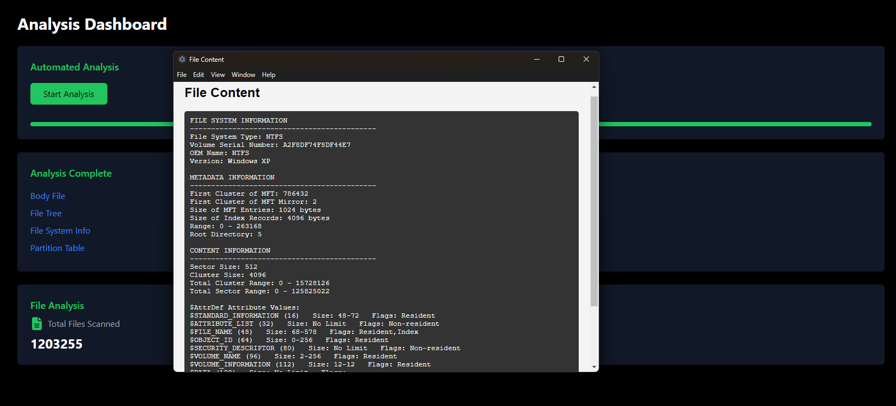
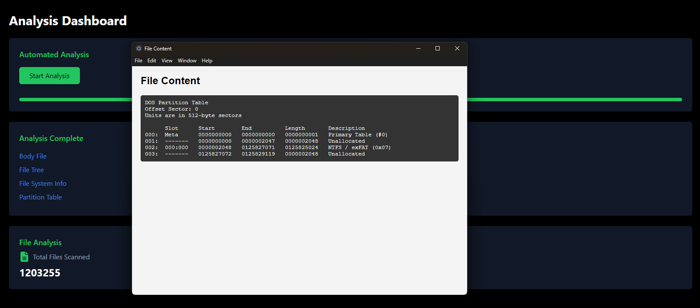
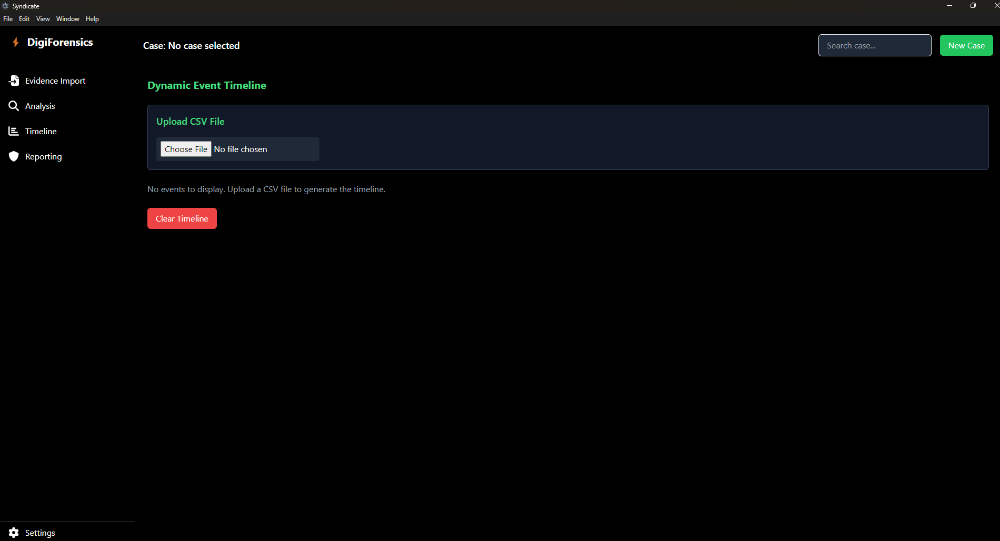
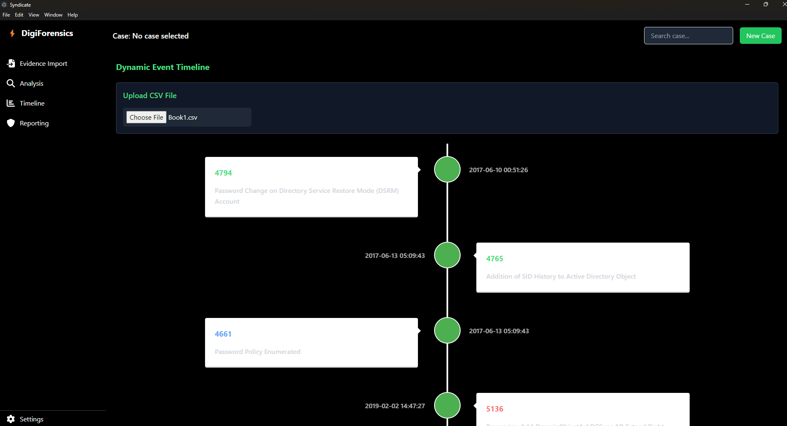
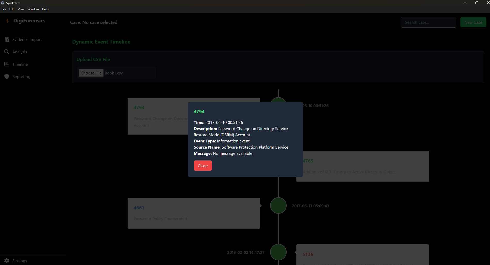
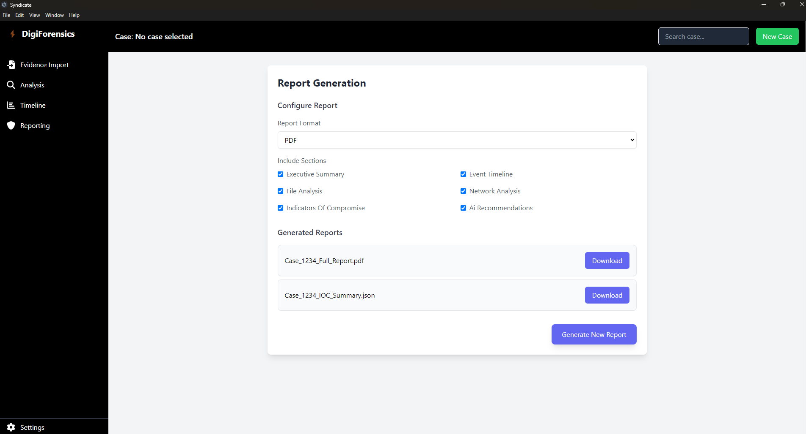
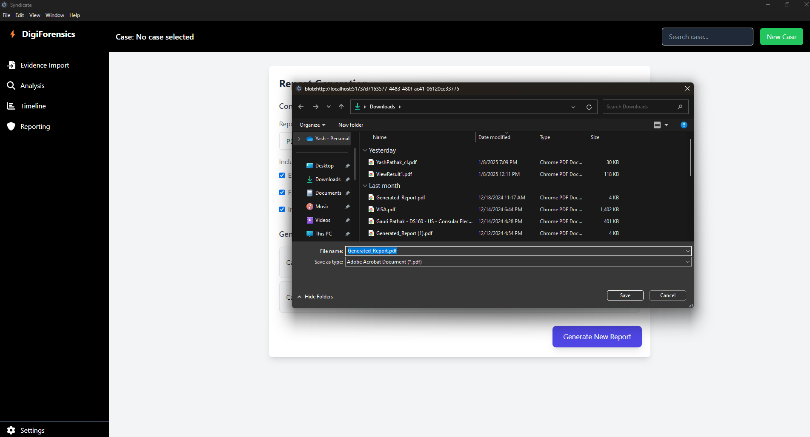
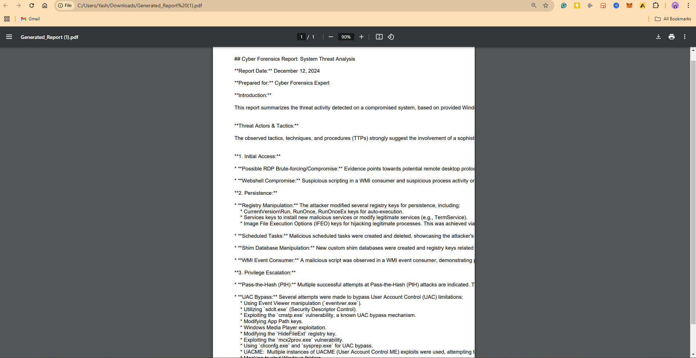

# CyberTriageTool  

## Introduction  

**CyberTriageTool** is our winning project of the **Smart India Hackathon 2024**.  

### About Smart India Hackathon  
The **Smart India Hackathon** is India's largest hackathon, conceptualized by Prime Minister **Narendra Modi** and organized by the **Government of India**. Various ministries and companies across the country provide problem statements, challenging undergraduate and postgraduate students to devise innovative solutions.  

Our problem statement was presented by the **National Investigation Agency (NIA)**:  
> **To design and develop an innovative digital forensics and incident response tool** with an intuitive and accessible interface for investigators, that streamlines the process of importing evidence, conducting automated analysis, and generating detailed reports.  

### Key Features Required for the Tool  
The tool should:  
1. Enable **automated data collection** from forensic disk images (RAW images) and other formats using disk imaging tools.  
2. Support the **scanning and analysis of data**, including files, system logs, registry entries, and network activity.  
3. **Identify Indicators of Compromise (IoCs)** and related suspicious activities.  
4. Incorporate **AI/ML algorithms** for anomaly detection and pattern recognition, featuring:  
   - A scoring system for prioritization.  
   - A recommendation engine to highlight critical artifacts.  
5. Offer **user-friendly review options**, such as interactive timelines, graphical summaries, and robust reporting capabilities, supporting exports in formats like PDF, JSON, and CSV.  

---

## Current Features  

CyberTriageTool can:  
- Parse **RAW disk images** to extract meaningful data.  
- Retrieve and analyze **registry logs** and **network logs**.  
- Analyze **browser history** for potential clues and anomalies.  
- Create **comprehensive timelines** to track events leading to an attack.  
- Detect anomalies and flag **Indicators of Compromise (IoCs)**.  
- Leverage **Generative AI** to compile **insightful reports** for investigators.  

---  

- Importing evidence such as **RAW disk images** to start analysis
   
- Parse **RAW disk images** to extract meaningful data.  
  
  
  
  -  **Timeline** created from the event logs
   
  
  
- Generating a **Report** from the Indicators of Compromise.
  
  
  
  
  
  

